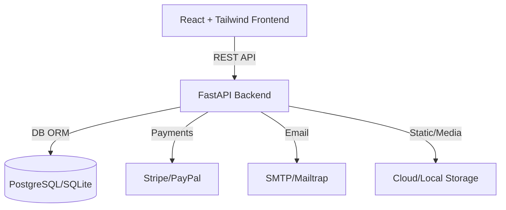

# DShop E-commerce Platform

## Executive Summary

DShop is a modern, full-stack e-commerce platform designed for scalability, security, and a seamless user experience. It features a professional React/Tailwind CSS frontend and a robust FastAPI backend, supporting advanced authentication, payments, inventory, and admin management. Built for rapid development and enterprise deployment, DShop is ideal for startups and organizations seeking a production-ready commerce solution.

---

## Features

- **Modern UI/UX**: Responsive, accessible, and visually appealing frontend
- **Authentication**: JWT, refresh tokens, 2FA, email verification, password reset
- **Role Management**: User/admin roles, RBAC, audit logging
- **Product & Inventory**: CRUD, image upload, inventory tracking
- **Cart & Orders**: Cart management, order processing, status tracking
- **Payments**: Stripe & PayPal integration, webhook verification
- **Email Notifications**: Order confirmations, payment receipts, status updates
- **Admin Dashboard**: User, product, order, and payment management
- **Security**: CSRF, CORS, rate limiting, password strength, global error handling
- **Extensible**: Modular architecture for easy customization

---

## Architecture Overview



---

## Tech Stack

### Frontend
- **React 19**
- **Tailwind CSS 4**
- **Vite**
- **Axios**
- **Formik & Yup**
- **ESLint**

### Backend
- **FastAPI**
- **SQLAlchemy & Alembic**
- **Pydantic**
- **Stripe, PayPal SDKs**
- **Jinja2 (emails)**
- **Mailtrap (dev email)**
- **Uvicorn (ASGI server)**

---

## Setup & Installation

### Prerequisites
- Node.js (>=18), Yarn
- Python 3.10+
- PostgreSQL or SQLite (default)

### 1. Clone the Repository
```bash
git clone <repo-url>
cd ecommerce
```

### 2. Backend Setup
```bash
cd backend
python -m venv venv
source venv/bin/activate  # or venv\Scripts\activate on Windows
pip install -r requirements.txt
cp .env.example .env  # Fill in secrets
uvicorn main:app --reload
```

### 3. Frontend Setup
```bash
cd ../frontend
yarn install
yarn dev
```

---

## Environment Configuration

- **Backend**: Configure `.env` with DB, SMTP, Stripe, PayPal, JWT secrets (see `backend/.env.example`).
- **Frontend**: API base URL is set in `src/api/index.js` (`http://localhost:8000/api/v1`). Update as needed for production.

---

## API & Integration

- **Docs**: [http://localhost:8000/docs](http://localhost:8000/docs)
- **Endpoints**: `/api/v1/auth/`, `/api/v1/products/`, `/api/v1/orders/`, `/api/v1/payments/`, `/api/v1/admin/`, etc.
- **Auth**: JWT Bearer tokens, refresh logic, 2FA (TOTP)
- **Payments**: Stripe/PayPal webhooks (public endpoint required for local dev)
- **Email**: SMTP (Mailtrap for dev), Jinja2 templates

---

## Project Structure

```
.
├── backend/
│   ├── api/         # Routers: auth, products, cart, orders, payments, admin
│   ├── core/        # DB, security, logging, email utils
│   ├── models/      # SQLAlchemy models
│   ├── schemas/     # Pydantic schemas
│   ├── templates/   # Jinja2 email templates
│   ├── static/      # Static/media files
│   ├── main.py      # FastAPI entrypoint
│   └── ...
├── frontend/
│   ├── src/
│   │   ├── components/  # React components
│   │   ├── api/         # API integration (index.js, auth.js, products.js)
│   │   ├── pages/       # Page components
│   │   └── ...
│   ├── tailwind.config.js
│   ├── vite.config.js
│   └── ...
└── README.md
```

---

## Deployment

- **Frontend**: Build with `yarn build`, deploy `dist/` to your host (Vercel, Netlify, etc.)
- **Backend**: Deploy with Uvicorn/Gunicorn, set environment variables, use HTTPS, configure CORS, secure secrets
- **Database**: Use Alembic for migrations
- **Payments**: Set production webhook URLs

---

## Contributing

1. Fork the repo & create a feature branch
2. Follow code style and commit conventions
3. Ensure all tests pass
4. Open a pull request with a clear description

---

## License

MIT

---

*Built with ❤️ by the [Ajiboye Pius](https://github.com/Adeleye080)* 